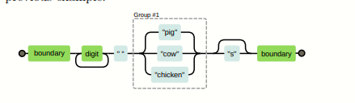

# Regular expression 🥇  

        Regular expressions are a way to describe patterns in string data. They form a small, separate language that is part of JavaScript and many other languages and systems.  
## 1. Creating a regular expression 👍  

    There are two way to create a reagular expression , the first is  constructed with the RegExp constructor , the second is written as a literal value by enclosing a pattern in forward slash (/) characters.  
`let re1 = RegExp("ahmed") ;`  
`let re2 = /ahmed/ ;`

        backslashes has another meaning ;Some characters , such as questions marks and plus signs , have special meaning and , must be preceded by a backslashes .  
`let eighteenPlus = /eighteen\+/;`   
## 2. Testing for matches 👍  

        Regular expressions have a number of methods . The simplest one is test . if you pass it a string , it will return a Boolean telling you if the string contains a match of pattern in the expressions .  
`console.log(/abc/.test("abcde"));`  
`// → true`  
`console.log(/abc/.test("abxde"));`  
`// → false`  
## 3. Sets of characters 👍  

        Finding out whether a string contains abc could just as well be done with a call to indexOf .  
`console.log("sjsjsabcjslqjs".indexOf("abc"));`  
` ==> 5 `  
    
        so the regular expressions is more complicated than that , so if we want to match any number :  
`console.log(/[0123456789]/.test("in 1992"));`  
`==> true`  
`console.log(/[0-9]/.test("in 1992"));`  
`==> true`  

    A number of common characters groups have their own built shortcuts 
    Digits are one of them: \d means the same thing as [0-9]. 
    \d : Any digit character 
    \w : all An Alphanumeric character (alpha + number )
    \s : Any whitespace character (space + tab + newLine and similar )
    \D : All characters except digits
    \W : A nonalphanumeric characters 
    \S : A nonwhiteSpace characters 
### Exemple 📧
        console.log(/\d/.test('1254hqh'));
        ==> true
        console.log(/\d/.test('errami'));
        ==> false

        console.log(/\D/.test('hq=+h'));
        ==> true
        console.log(/\D/.test('8547'));
        ==> false

        console.log(/\w/.test('85=@4fadele+llah7'));
        ==> true
        console.log(/\w/.test('@#+=*.'));
        ==> false

        console.log(/\W/.test('@#+=*.'));
        ==>true
        console.log(/\W/.test('errami2001'));
        ==> false

        console.log(/\s/.test('\n\t     '));
        ==> true
        console.log(/\s/.test('errami0@200'));

        console.log(/\S/.test('\t\n     '));
        ==> false
        console.log(/\S/.test('\t\n  errami @ #2001  '));
        ==> true 

        console.log(/\d\d-\d\d-\d\d\d\d/.test('24-08-2001'));
        ==> true
        console.log(/\d\d-\w\w\w-\d\d\d\d/.test('24-jan-2001'));
        ==> true
        console.log(/\d\d-\w\w-\d\d\d\d/.test('24-08-2001'));
        ==> true 

### brackets in regular expression 
&nbsp;&nbsp;&nbsp;&nbsp;&nbsp;&nbsp;&nbsp;&nbsp;If you don't use square brackets, the meaning of the code changes. For example, without the square brackets, the code /\d./ will match any character that is followed by a digit. This is different from /[\d.]/ which will match any single digit or decimal point. The brackets define a set of characters that must be found, while without the brackets the meaning of the code depends on the character following the reverse barcode.    

**Exemple**

        console.log(/[\d.]/.test('.'));
        // ==> true 
        console.log(/[\d.]/.test('548'));
        // ==> true 

        console.log(/\d.errami/.test('1.errami'));
        // ==> true   

        
&nbsp;&nbsp;&nbsp;&nbsp;&nbsp;&nbsp;&nbsp;&nbsp;To invert a set of characters—that is, to express that you want to match any
character except the ones in the set—you can write a caret (^) character after
the opening bracket.    

        let notBinary = /[^01]/;
        console.log(notBinary.test("1100100010100110"));
        // → false
        console.log(notBinary.test("1100100010200110"));
        // → true
&nbsp;&nbsp;&nbsp;&nbsp;&nbsp;&nbsp;&nbsp;&nbsp;This regular expression defines a pattern to identify character strings that are not made up of only "0" or "1". It can be used to check whether or not a string is valid as a binary number.

&nbsp;&nbsp;&nbsp;&nbsp;&nbsp;&nbsp;&nbsp;&nbsp;For example, if you test the string "1010101" with this regular expression, it will return a result of false because it consists of only "0" and "1". If you test the string "1010102", it will return true because it contains a character other than "0" or "1" (here, "2").  

## 4. Repeating part of pattern 👍
&nbsp;&nbsp;&nbsp;&nbsp;&nbsp;&nbsp;&nbsp;&nbsp;When you put a plus sign (+) after something in a regular expression, it
indicates that the element may be repeated more than once. Thus, /\d+/
matches one or more digit characters.  
&nbsp;&nbsp;&nbsp;&nbsp;&nbsp;&nbsp;&nbsp;&nbsp;The star (*) has a similar meaning but also allows the pattern to match zero
times.  

        console.log(/'\d+'/.test("'123'"));
        // → true
        console.log(/'\d+'/.test("''"));
        // → false
        console.log(/'\d*'/.test("'123'"));
        // → true
        console.log(/'\d*'/.test("''"));
        // → true
        💯
        console.log(/\d+/.test("123"));
        // → true
        console.log(/\d+/.test(""));
        // → false
        console.log(/\d*/.test("123"));
        // → true
        console.log(/\d*/.test(""));
        // → true  

&nbsp;&nbsp;&nbsp;&nbsp;&nbsp;&nbsp;&nbsp;&nbsp;A question mark makes a part of a pattern optional, meaning it may occur
zero times or one time.

        let neighbor = /neighbou?r/;
        console.log(neighbor.test("neighbour"));
        // → true
        console.log(neighbor.test("neighbor"));
        // → true  

&nbsp;&nbsp;&nbsp;&nbsp;&nbsp;&nbsp;&nbsp;&nbsp;To indicate that a pattern should occur a precise number of times, use braces .

        let dateTime = /\d{1,2}-\d{1,2}-\d{4} \d{1,2}:\d{2}/;
        console.log(dateTime.test("1-30-2003 8:45"));
        // → true   
&nbsp;&nbsp;&nbsp;&nbsp;&nbsp;&nbsp;&nbsp;&nbsp;You can also specify open-ended ranges when using braces by omitting the
number after the comma. So, {5,} means five or more times. 

## 5.Grouping subexpressions 👍 

### Example 🧟

        let cartoonCrying = /boo+(hoo+)+/i;
        console.log(cartoonCrying.test("Boohoooohoohooo"));
        // → true  

## 6.Matches and groups 👍
&nbsp;&nbsp;&nbsp;&nbsp;&nbsp;&nbsp;&nbsp;The test method is the absolute simplest way to match a regular expression.
It tells you only whether it matched and nothing else. Regular expressions also
have an exec (execute) method that will return null if no match was found
and return an object with information about the match otherwise.  
### Example 🧟   

        let match = /\d+/.exec("one two 100");  
        // ==> [ '100', index: 8, input: 'one two 100', groups: undefined ]  
        console.log(match.index);
        // ==> 8  

&nbsp;&nbsp;&nbsp;&nbsp;&nbsp;&nbsp;&nbsp;An object returned from exec has an index property that tells us where in
the string the successful match begins. Other than that, the object looks like
(and in fact is) an array of strings, whose first element is the string that was
matched. In the previous example, this is the sequence of digits that we were
looking for.  
&nbsp;&nbsp;&nbsp;&nbsp;&nbsp;&nbsp;&nbsp;String values have a match method that behaves similarly.

        console.log("one two 100".match(/\d+/));  
        // ==> [ '100', index: 8, input: 'one two 100', groups: undefined ]  

&nbsp;&nbsp;&nbsp;&nbsp;&nbsp;&nbsp;&nbsp;When the regular expression contains subexpressions grouped with parentheses, the text that matched those groups will also show up in the array.
&nbsp;&nbsp;&nbsp;&nbsp;&nbsp;&nbsp;&nbsp;The whole match is always the first element. The next element is the part
matched by the first group (the one whose opening parenthesis comes first in
the expression), then the second group, and so on.

        let phoneNumber = /\b(0[67] \d{2} \d{2} \d{2} \d{2})\b/;
        let string = "Mon numéro de téléphone est 07 01 74 13 09";
        let match1 = string.match(phoneNumber);
        let captured = match1[1]; // 07 01 74 13 09
        console.log(captured);
        // ==> 07 01 74 13 09

The \b metacharacter matches at the beginning or end of a word.

Search for the pattern LO at the beginning of a word like this:
\bLO

Search for the pattern LO at the end of a word like this:
LO\b    

         let text = "HELLO, LOOK AT YOU";
        let pattern = /\bLO/;
        console.log(text.match(pattern));
        // ==> [ 'LO', index: 7, input: 'HELLO, LOOK AT YOU', groups: undefined ]

        let text = "HELLO, LOOK AT YOU";
        let pattern = /LO\b/;
        console.log(text.match(pattern));
        // ==> [ 'LO', index: 3, input: 'HELLO, LOOK AT YOU', groups: undefined ]

        let text = "HELLO, LOOK AT YOU LO";
        let pattern = /\bLO\b/;
        console.log(text.match(pattern));
        // ==> [ 'LO', index: 19, input: 'HELLO, LOOK AT YOU LO', groups undefined ]

&nbsp;&nbsp;&nbsp;&nbsp;&nbsp;&nbsp;&nbsp;When a group does not end up being matched at all (for example, when followed by a question mark), its position in the output array will hold undefined.
Similarly, when a group is matched multiple times, only the last match ends
up in the array .

        console.log(/bad(ly)?/.exec("bad"));
        // ==> [ 'bad', undefined, index: 0, input: 'bad', groups: undefined ]  

        let regex = /(\w+)?(\d+)/;
        let string = "Hello 123";
        let matches = string.match(regex);

        console.log(matches);
        // Output: [ "Hello 123", "Hello", "123", index: 0, input: "Hello 123" ]

        // ==> 
        [
                "Hello 123", // La correspondance complète
                "Hello",     // La correspondance du premier groupe
                "123",       // La correspondance du second groupe
                index: 0,
                input: "Hello 123"
        ]

        console.log(/(\d)+/.exec("123"));
        // ==>  [ '123', '3', index: 0, input: '123', groups: undefined ]

## 7. The Date Class 👍  

&nbsp;&nbsp;&nbsp;&nbsp;&nbsp;&nbsp;&nbsp;JavaScript has a standard class for representing dates—or, rather, points in
time. It is called Date. If you simply create a date object using new, you get
the current date and time.  

        console.log(new Date());
        // ==> 2023-02-01T14:15:10.547Z  

You can also create an object for a specific time.

        console.log(new Date(2001,08,24));
        // ==> 2001-09-23T22:00:00.000Z 

&nbsp;&nbsp;&nbsp;&nbsp;&nbsp;&nbsp;&nbsp;JavaScript uses a convention where month numbers start at zero (so December is 11), yet day numbers start at one. This is confusing and silly. Be
careful.  

        console.log(new Date(2009, 11, 9, 12, 59, 59, 999));
        // ==> 2009-12-09T11:59:59.999Z 

&nbsp;&nbsp;&nbsp;&nbsp;&nbsp;&nbsp;&nbsp;The last four arguments (hours, minutes, seconds, and milliseconds) are optional and taken to be zero when not given.  

&nbsp;&nbsp;&nbsp;&nbsp;&nbsp;&nbsp;&nbsp;Timestamps are stored as the number of milliseconds since the start of 1970,
in the UTC time zone. This follows a convention set by “Unix time”, which
was invented around that time. You can use negative numbers for times before
1970. The getTime method on a date object returns this number. It is big, as
you can imagine  .  

        console.log(new Date(2001, 08, 24).getTime());
        // ==> 1001282400000 // milliseconds 

        console.log(new Date(1001282400000));
        // ==> 2001-09-23T22:00:00.000Z  

&nbsp;&nbsp;&nbsp;&nbsp;&nbsp;&nbsp;&nbsp;Date objects provide methods such as getFullYear, getMonth, getDate, getHours
, getMinutes, and getSeconds to extract their components. Besides getFullYear
there’s also getYear, which gives you the year minus 1900 (98 or 119) and is
mostly useless.  
  
    
&nbsp;&nbsp;&nbsp;&nbsp;&nbsp;&nbsp;&nbsp;we can now create a date object from a string  

        function getDate(string) {
        let [_, month, day, year] =
        /(\d{1,2})-(\d{1,2})-(\d{4})/.exec(string);
        return new Date(year, month - 1, day);
        }

        console.log(getDate("08-24-2001"));
        // ==> 2001-08-23T22:00:00.000Z

## 8. The mechanics of matching 👍  

        let animalCount = /\b\d+ (pig|cow|chicken)s?\b/;
        console.log(animalCount.test("15 pigs"));
        // ==> true
        console.log(animalCount.test("15 pigchickens"));
        // ==> false

   
 
 ## 9. The replace method 👍
 &nbsp;&nbsp;&nbsp;&nbsp;&nbsp;&nbsp;&nbsp;String values have a replace method that can be used to replace part of the
string with another string.  

        console.log("papa".replace("p", "m"));
        // ==> mapa

        console.log("Borobudur".replace(/[ou]/, "a"));
        // ==> Barobudur
        console.log("Borobudur".replace(/[ou]/g, "a"));
        // ==> Barabadar

